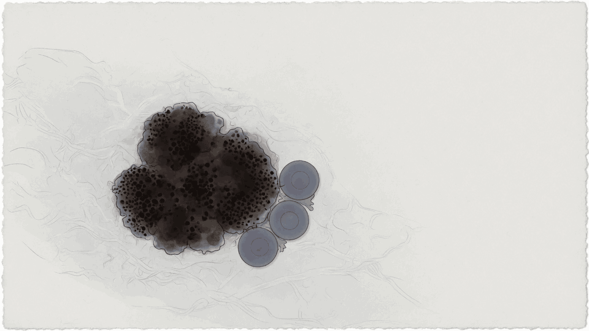
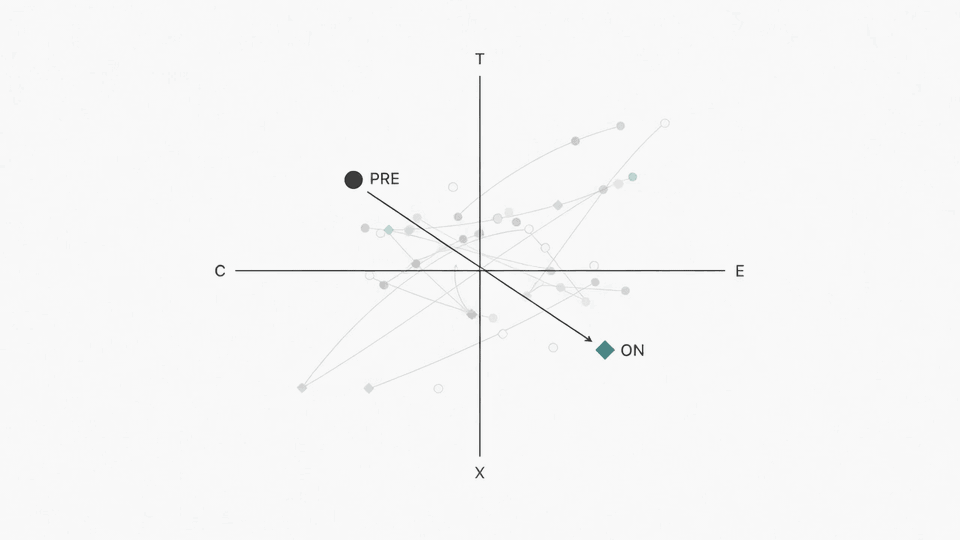

# Paired measurements and biological change

*What paired biological measurements identify about biological change*



*Melanoma tumour–immune context. Paired tissue measurements sample tumour and immune-cell programmes together.*

In melanoma immune checkpoint blockade, paired pretreatment and on-treatment transcriptomes are mapped into a frozen T/E/X/C state representation. We use these paired states to distinguish second-state information, recorded orientation, coherent movement, response relevance, biological carrier and interpretation across contexts. The central question is what the observed biological change identifies.

## The question

One state records where the system began, another where it arrived. We ask six distinct questions of the same paired observation:

- second-state information
- recorded orientation
- coherent movement
- response specificity and incremental value
- biological carrier
- interpretation domain

## What was tested

The same frozen T/E/X/C representation maps pretreatment and on-treatment measurements into a shared state space.



*PRE → ON displacement. The arrow connects the two recorded states; the paired analyses examine the information, direction and response relevance of that change.*

Within the MELD-ICB evaluation, A/U/O isolated second-state content and recorded orientation. Movement, response specificity, incremental value, carrier and context transfer were evaluated separately. Patients, folds, preprocessing, learner and decision direction were held fixed where applicable.

## Main findings

| Interface | Result and interpretation |
|-----------|---------------------------|
| Pair content and orientation | In 27 paired patients, mean held-out loss was $L_A=0.728$, $L_U=0.640$ and $L_O=0.533$. The orientation-associated gain was $G_{OU}=0.107$; its 95% grouped-patient bootstrap interval was −0.354 to 0.729. Orientation-sensitive predictive structure was observed in the fixed procedure, while its population magnitude remained imprecise. |
| Movement | Across 16 therapy records from 15 patients, the boundary increased in 14/16 records (paired Wilcoxon $P=0.0017$); cohort-mean cosine was 0.987 and median record-level cosine was 0.699. The sampled transcriptomic state moved strongly and coherently across the observed interval. |
| Response specificity and incremental value | Boundary-change AUC was 0.327, transition-cosine AUC was 0.364 and mean $\Delta L$ was −0.0813. The dominant displacement extended across response groups and did not improve mean held-out prediction beyond pretreatment state. |
| Biological carrier | The T coordinate remained computable in CD45+-restricted material, where 86.293% of its signal was lymphoid-carried and 0.079% malignant-carried (three malignant cells). A numerical coordinate can remain computable when its biological carrier differs from the original referent. |
| Interpretation domain | GSE78220 AUC was 0.476 and IMvigor210 AUC was 0.400. Selected axis-level phenotype structure persisted while the original response interpretation did not transfer. |

## A/U/O observation interfaces

- **A** — pretreatment state
- **U** — complete unordered pair content
- **O** — the same pair with recorded pre-to-on orientation restored

For pretreatment and on-treatment T/E/X/C vectors:

$$
d=a_{\mathrm{on}}-a_{\mathrm{pre}}, \qquad
m=\frac{a_{\mathrm{pre}}+a_{\mathrm{on}}}{2}
$$

$$
A=a_{\mathrm{pre}}, \qquad
U=[m,\mathrm{vech}(dd^{\mathsf T})], \qquad
O=[U,d]
$$

This construction separates information in the second state from information associated with the recorded orientation.

## What each analysis shows

Each analysis answers a distinct question. The results form a non-compensatory profile, with every component reported separately.

| Component | Question | Status |
|-----------|----------|--------|
| B0 | Is the measurement system fixed? | Partial / historical preprocessing lineage **conflict** |
| B1 core | Does state transfer in PRJEB23709 and MORRISON-1-public? | **Supported** |
| B1 MGH biopsy | Does state transfer at biopsy level? | **Not supported** |
| B1 MGH patient | Does the earliest eligible on-treatment biopsy support patient-level transfer? | Supportive, different analysis unit |
| B2 | Does the sampled state move? | **Supported** |
| B3 | Is movement outcome-specific? | **Not supported** |
| B4 | Does observed change add incremental information? | **Not supported** |
| B5 | Is the biological carrier identified? | Descriptive |
| B6 | Where does interpretation stop? | Envelope declared |
| Intervention specificity | Is movement specific to ICB? | **Not tested** |

The frozen separator is `−0.676T + 0.173E + 0X + 1.135C − 0.666`, with threshold `0.735`. Higher scores are responder-like throughout. See the [component-level interpretation](docs/SCIENTIFIC_CLAIM_BOUNDARY.md) for details.

## Reproduction

Python 3.11 is required. Dependencies are lower-bounded in [`pyproject.toml`](pyproject.toml); there is no lockfile.

```text
python -m venv .venv
python -m pip install -e ".[dev]"
```

Activate with `.\.venv\Scripts\Activate.ps1` on Windows or `source .venv/bin/activate` on Linux/macOS.

### Level 1 — tests and repository invariants

```text
python -m pytest -q
python scripts/scan_public_repository.py
```

This checks installation, frozen constants, invariants, public-repository boundaries and missing-data HOLD behavior.

### Level 2 — committed Source Data

```text
python scripts/reproduce_core_results.py
python scripts/plot_figures.py
```

This reconciles reported values against committed derived tables and redraws quantitative Figures 2–5, subject to the Figure 5 panel-c boundary below.

### Level 3 — public-accession rebuild

```text
python scripts/acquire_data.py
python scripts/recompute_results.py --truth-root <path>
python scripts/reproduce_all.py --mode analysis --truth-root <path>
```

The acquisition command emits a checklist for obtaining inputs under their original terms. Missing data, schema or provenance exit **HOLD**. See [`docs/REPRODUCIBILITY_SCOPE.md`](docs/REPRODUCIBILITY_SCOPE.md) for the accession-rebuild requirements.

Conda alternative: `conda env create -f environment.yml`.

## Figures and Source Data

| Material | Reproduction boundary |
|----------|-----------------------|
| Figure 1 | Conceptual author artwork; no numeric producer and not included in this tree |
| Figures 2–4 | Quantitative redraws from committed [`source_data/`](source_data/) tables |
| Figure 5 | Quantitative redraw except panel c; IMvigor210 is represented by its paper-reported summary AUC/CI/P and accession only |
| Publication boards | Final Adobe composition is outside the code-reproduction claim |

`python scripts/plot_figures.py` writes local PDF and PNG outputs to the ignored `figures/reproduced/` directory. See [`figures/README.md`](figures/README.md) and [`source_data/README.md`](source_data/README.md).

## Data

No new raw sequencing data were generated. The study uses public transcriptomic accessions; this repository commits redistributable derived numeric Source Data only. Raw matrices, single-cell counts and restricted clinical objects are not redistributed.

| Dataset or object | Role | In this repository |
|-------------------|------|--------------------|
| Derived Source Data CSVs | Figure and table values | Committed derived tables |
| GSE91061, PRJEB23709, MORRISON-1-public, MGH | State and paired analyses | Accession only |
| GSE120575 (Sade-Feldman) | Carrier grounding | Accession only |
| GSE78220 | Primary interpretation-envelope cohort | Accession only |
| IMvigor210 | Comparison context | Accession and summary statistics only |

A public accession is not a redistribution licence. See [`docs/DATA_ACCESS.md`](docs/DATA_ACCESS.md) and [`manifests/datasets.tsv`](manifests/datasets.tsv).

## Repository map

| Path | Role |
|------|------|
| [`src/`](src/) | Public analysis implementation |
| [`configs/`](configs/) | Frozen analysis and cohort configurations |
| [`scripts/`](scripts/) | Public analysis, reproduction and redraw entrypoints |
| [`source_data/`](source_data/) | Redistributable derived numeric tables |
| [`manifests/`](manifests/) | Dataset, producer and numeric-reconciliation contracts |
| [`tests/`](tests/) | Unit, invariant, leakage and reproduction tests |
| [`docs/`](docs/) | Claim boundary, data access and reproducibility scope |
| [`figures/`](figures/) | Figure reproduction notes; generated redraws are local and ignored |
| [`data/`](data/) | Local accession layout; raw inputs are not shipped |

## Citation, version and license

Cite the software via [`CITATION.cff`](CITATION.cff). The associated manuscript is *What paired biological measurements identify about biological change* by Yizhang Yang and Chao Yang.

The current package metadata reports version `1.0.1`. The current archived release is [`v1.0.1`](https://github.com/krilito/noncompensatory-biological-dynamics/releases/tag/v1.0.1), with version DOI [10.5281/zenodo.22273685](https://doi.org/10.5281/zenodo.22273685) and concept DOI [10.5281/zenodo.21975985](https://doi.org/10.5281/zenodo.21975985). The [`v1.0.0-preprint`](https://github.com/krilito/noncompensatory-biological-dynamics/releases/tag/v1.0.0-preprint) archive remains available as the historical record at [10.5281/zenodo.21975986](https://doi.org/10.5281/zenodo.21975986).

```bibtex
@software{yang2026noncompensatory,
  author  = {Yang, Yizhang},
  title   = {Paired measurements and biological change},
  year    = {2026},
  version = {v1.0.1},
  doi     = {10.5281/zenodo.22273685},
  url     = {https://github.com/krilito/noncompensatory-biological-dynamics}
}
```

Code is licensed under the [MIT License](LICENSE). Source datasets remain under their original terms; the MIT licence does not relicense them.
